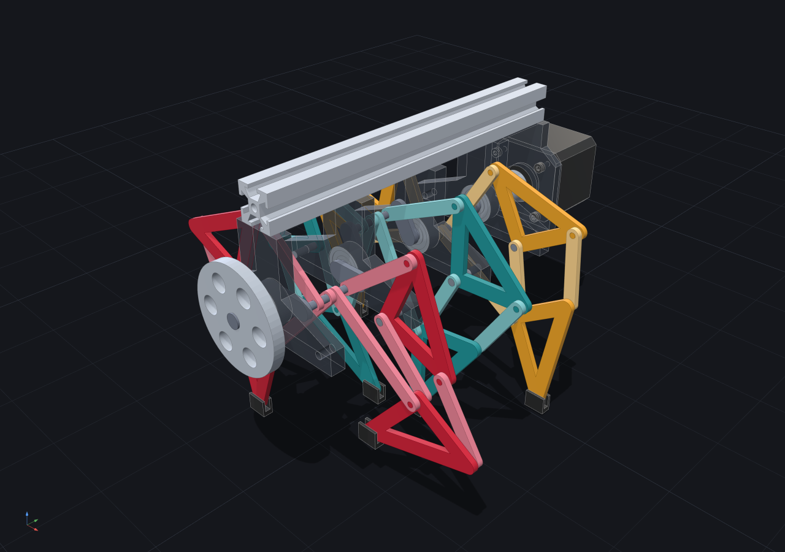
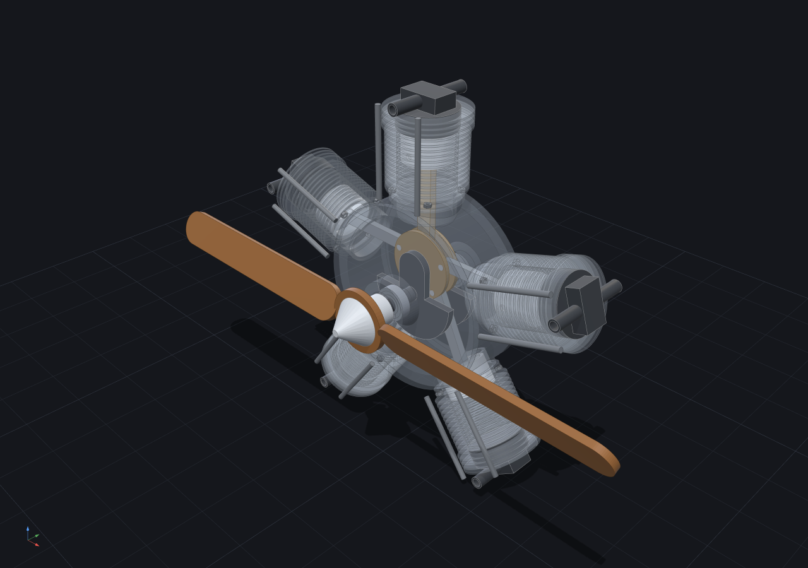
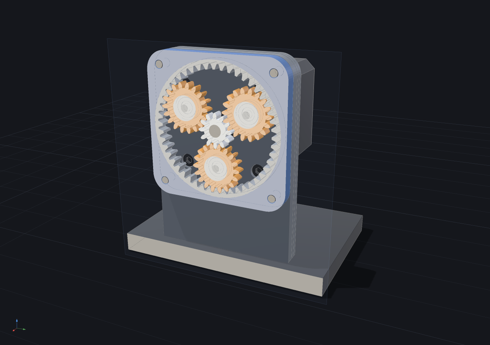
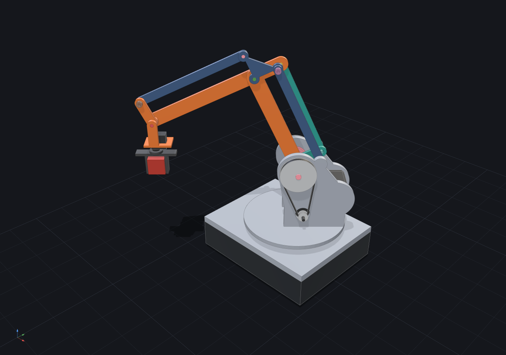
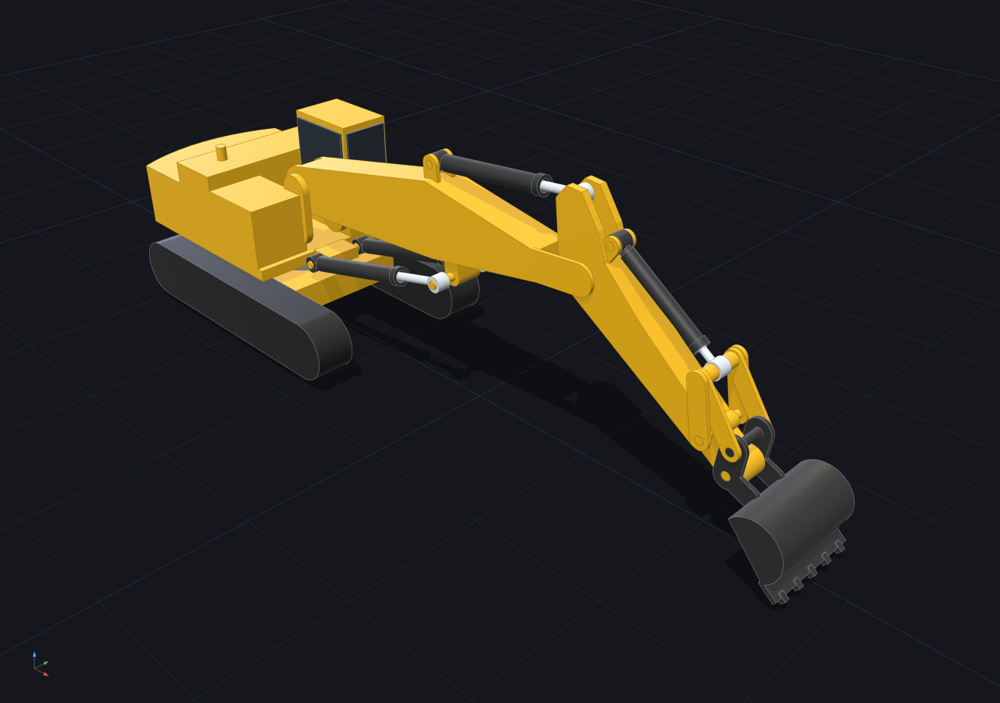
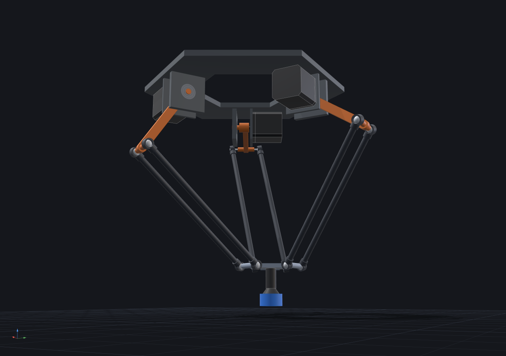

# cadsmith

A Claude Code skill suite that generates parametric 3D models (build123d/CadQuery) and interactive Three.js previews from natural language descriptions of physical objects. Describe what you want to make, and cadsmith produces a print-ready model alongside a browser-based 3D preview you can orbit and inspect.

## Install

```bash
git clone git@github.com:JonFermin/cadsmith.git
cd cadsmith
```

The skills auto-load when Claude Code runs from this directory.

## Usage

From Claude Code:

```
/make-model a phone stand
/make-model design a bracket for my shelf
/make-model create a cable organizer with 6 slots
/edit-model street_intersection
/export-model bracket -f glb
/make-mechanism a servo arm that lifts 100 g through 180°
```

Or just describe what you want in natural language — the CLAUDE.md hints Claude to use the skill when you mention modeling or designing physical objects.

## Skills

| Skill | Purpose |
|-------|---------|
| `/make-model` | Generate parametric build123d Python models + Three.js preview manifests |
| `/edit-model` | Review and fix existing models via reviewer/fixer agent team |
| `/export-model` | Export models to STL, OBJ, glTF, or GLB via Blender pipeline |
| `/make-mechanism` | Design and verify moving assemblies with the `mech` framework (see below) |

## Previewer

The repo includes a standalone Three.js previewer for inspecting generated models:

```bash
cd previewer
npm install
npm run dev
```

This opens a browser at http://localhost:3000. Load a `_manifest.json` file via the file picker, drag & drop, or URL parameter.

## Mechanisms (`mech`)

`mech` analyzes moving assemblies — linkages, hinges, gear trains, lead-screw stages, servo
arms — from a short build123d **model script**: parts modeled in place, joints, and intent
(actuators, motion studies, design targets). Everything else is deterministic: kinematics with
loop closure, clearance/interference sweeps over the motion, mass properties, quasi-static gravity
holding loads, target checks, viewer export and screenshots. A design iteration is one command
and a ~10-line summary. Out of scope: dynamics, friction, FEA.

```bash
uv sync                                          # Python 3.12 env (build123d, numpy, scipy)
uv run mech run examples/four_bar.py             # analyze + export output/four_bar.mech/
uv run mech run examples/hinged_box.py -p gap=-1 # override build() params
uv run mech run examples/scissor_lift.py --frames 12   # quick partial run (not exported)
uv run mech check examples/gear_train.py         # validate + home-pose clearance, no studies
uv run mech sweep examples/four_bar.py crank=30:45:5   # parameter grid, one row per variant
uv run mech shot four_bar --ghost 6 --layout quad      # headless PNG (needs playwright)
uv run mech list                                 # exported mechanisms and their status
uv run pytest                                    # test suite (analytic checks)
```

```
mech four_bar — PASS   4 parts · 3 joints (1 driver, 2 passive) · 1 loop · 42.4 g · CoG (60.8, 22.5, 3.6)
OK   loop p_B closed (max 6.96e-14 mm) · no branch jumps · mobility 0
clearance min 13.0 mm (frame/coupler @f0 j_crank=0°) · required 0.3 · 6 pairs checked
no gravity load on j_crank (axis ∥ g or balanced)
targets 1/1 · rocker swing span:j_rocker 62.1 ≥ 40
ranges j_crank 0…360° · j_coupler −360…0° · j_rocker −13.2…48.9° · probe mid Δ(71.1, 58.0, 0) path 197 mm
Δprev: first run
view http://localhost:3000/mech.html?m=four_bar&ghost=6&layout=quad&ui=0 · shot: uv run mech shot four_bar
```

Exit codes: PASS 0, WARN 1, FAIL 2, INVALID/error 3. Units: mm, degrees, g, N·m / N; Z up.
`--study`/`--frames` runs are partial: the header says so, targets that need a skipped study are
"not evaluated" (so is any callable target's miss), and `output/<name>.mech/` keeps the last full
run (what `list`, `shot` and the viewer show).

- **Examples** (`examples/`): `four_bar`, `slider_crank`, `gear_train` (NEMA 17 + 15:30 gears +
  625 bearing), `leadscrew_stage` (T8 screw, LM8UU carriage), `pendulum_arm` (MG996R servo,
  payload, safety-factor target), `hinged_box` (two lids; `gap` drives tight vs interference),
  `parallel_gripper` (SG90 + gear pair + parallelogram jaws that must stay parallel),
  `scissor_lift` (NEMA 17 + T8 screw driving a two-stage scissor, payload, motor SF).
  Each is checked against closed-form truth in `tests/test_examples.py`.
- **Showcase** (`examples/showcase/`, below): six larger designs, each hand-checked; every one
  passes `mech check` in the default test run and a full PASS with its headline numbers under
  `uv run pytest -m slow`.
- **Standard parts** (`mech.parts`): NEMA 17/23, SG90/MG996R/N20 motors, ball and linear
  bearings, involute spur gears/gear pairs/racks, GT2 pulleys, rods, T8 screw and nut, 2020/2040
  extrusions, ISO fasteners, ISO 286 fits — real dimensions, simplified geometry, attachment frames.
- **Viewer**: `cd previewer && npm run dev`, then open the `view` URL from the summary
  (`/mech.html?m=<name>`): timeline, ghosts, section plane, explode, issue list that jumps to the
  offending frame. `npm run build` produces the static bundle `mech shot` uses; every viewer URL
  parameter (`study`, `frame`, `view`, `cam`, `zoom`, `section`, `focus`, `paths`, …) is also a
  `mech shot` flag.
- **Docs**: the contract is `docs/MECH_SPEC.md`; the Claude-facing workflow and API cheat-sheet
  are `.claude/skills/make-mechanism/SKILL.md` and `references/mech-api.md`.

## Showcase

Six mechanisms built with `mech` — each a single script in `examples/showcase/`, analysed with
`uv run mech run examples/showcase/<name>.py` (PASS, every design target met) and pictured with
`uv run mech shot` (`--view iso --paths 0`; the gearbox `--section x:13 --cam 25,20`, the arm
`--hide desk`, the delta `--cam 30,-12`). The number under each is the one its hand check
reproduces.

| | |
|---|---|
|  |  |
| **Strandbeest** — Jansen linkage, 6 legs on one crank (18 closed loops): stride **67.8 mm**, step lift **22.5 mm** per foot. | **Radial engine** — 5 cylinders, a master rod and 4 articulated rods: strokes **44.000 / 44.049 / 44.156 mm** (master / articulated pairs). |
|  |  |
| **Planetary gearbox** (cut through stage 1) — two 5:1 stages with internal-gear rings on a NEMA 17: ratio **25:1**, sun holding torque **0.1482 N·m** for a 2.5 kg lever load. | **Desktop arm** — palletizing arm, every motor in the base, belts and three parallelograms: shoulder holding load **0.588 N·m** with a 200 g payload. |
|  |  |
| **Excavator** — 1:10 hydraulic excavator, four cylinders and the bucket four-bar: boom cylinder pair **340.4 N** at full reach. | **Delta robot** — Clavel delta on six ball-socket rods, IK-driven pick-and-place: max motor load **0.233 N·m**, platform level to 1e-13°. |

## How it works

1. You describe a physical object
2. cadsmith asks brief clarifying questions (1 round max, defaults aggressively)
3. Generates a parametric `.py` file (build123d) in `./output/` with `.step` and `.stl` exports
4. Generates a `_manifest.json` scene description for the previewer
5. Runs a reviewer/fixer agent loop to catch and correct issues
6. Opens the Three.js preview in your browser

The `.py` file is the source of truth. The Three.js preview is a fast visual approximation — difference() operations show as transparent red wireframes since true CSG isn't available in the browser.

## Project structure

```
cadsmith/
├── .claude/
│   ├── skills/
│   │   ├── make-model/           # Model generation skill
│   │   ├── edit-model/           # Review & fix skill
│   │   ├── export-model/         # Export pipeline skill
│   │   └── make-mechanism/       # Mechanism design + mech analysis skill
│   └── agents/
│       ├── review-model.md       # Visual review agent
│       └── fix-model.md          # Targeted fix agent
├── mech/                         # Mechanism analysis framework (Python package, `mech` CLI)
├── examples/                     # Reference mechanism scripts
├── tests/                        # pytest suite for mech
├── docs/MECH_SPEC.md             # mech contract
├── previewer/                    # Three.js preview app (Vite): index.html + mech.html
├── pipeline/                     # Export pipeline (Blender)
├── output/                       # Generated models and manifests (gitignored)
├── CLAUDE.md                     # Project-level Claude instructions
└── README.md
```

## License

MIT
